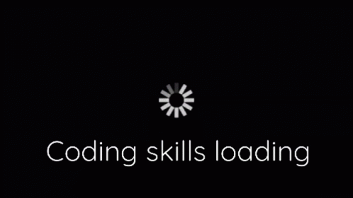

    
    

<h1 align="center">Ciao 🫰 sono Michelle Alberti</h1>
<h3 align="center">Sono una studentessa dell'Università di Genova - informatica</h3>

<h3 align="left">Connect with me:</h3>

<h3 align="left">Languages and Tools:</h3>

 
     
     

- 👋 Hi, I’m @AlbyMiscy
- 👀 I’m interested in ...
- 🌱 I’m currently learning ...
- 💞️ I’m looking to collaborate on ...
- 📫 How to reach me ...
- 😄 Pronouns: ...
- ⚡ Fun fact: ...

<!---
AlbyMiscy/AlbyMiscy is a ✨ special ✨ repository because its `README.md` (this file) appears on your GitHub profile.
You can click the Preview link to take a look at your changes.
--->
